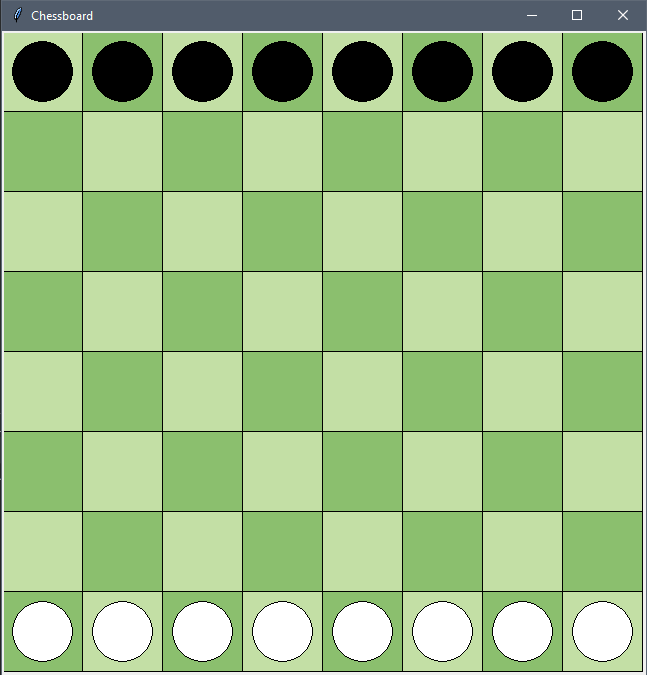

# Quantum Checkmate: A Python Game with Quantum Mechanics Twist

## Description
Quantum Checkmate is an exciting Python game inspired by the principles of quantum mechanics. Although it takes its foundational elements from chess, it offers a unique and original implementation, providing an immersive experience that combines strategy, quantum mechanics, and fun gameplay.

## Features
- Custom game mechanics based on the rules of chess
- Quantum mechanics-inspired interactions and moves
- Randomized outcomes with quantum twist
- Intuitive graphical user interface created with Tkinter
- Turn-based gameplay for two players

## Prerequisites
- Python 3.x
- Tkinter library

## How to Play
1. Run the Python script `main.py` to start the game.
2. The game window will open, displaying the game board.
3. Each player takes turns to make a move.
4. To move a piece, click and drag it to the desired destination.
5. Release the mouse button to place the piece in the new position.
6. The game follows a unique set of rules based on the principles of quantum mechanics.
7. Explore the quantum-inspired mechanics and their effects on gameplay.
8. Enjoy the strategic challenge and the intriguing possibilities that arise from the quantum realm!

## Screenshot

## Contributions
This project was developed as a collaborative effort by nmohanu and lost for a school project. We created a game that combines the fundamentals of chess with our own innovative implementation and quantum-inspired mechanics. Contributions, feedback, and suggestions are highly appreciated!
